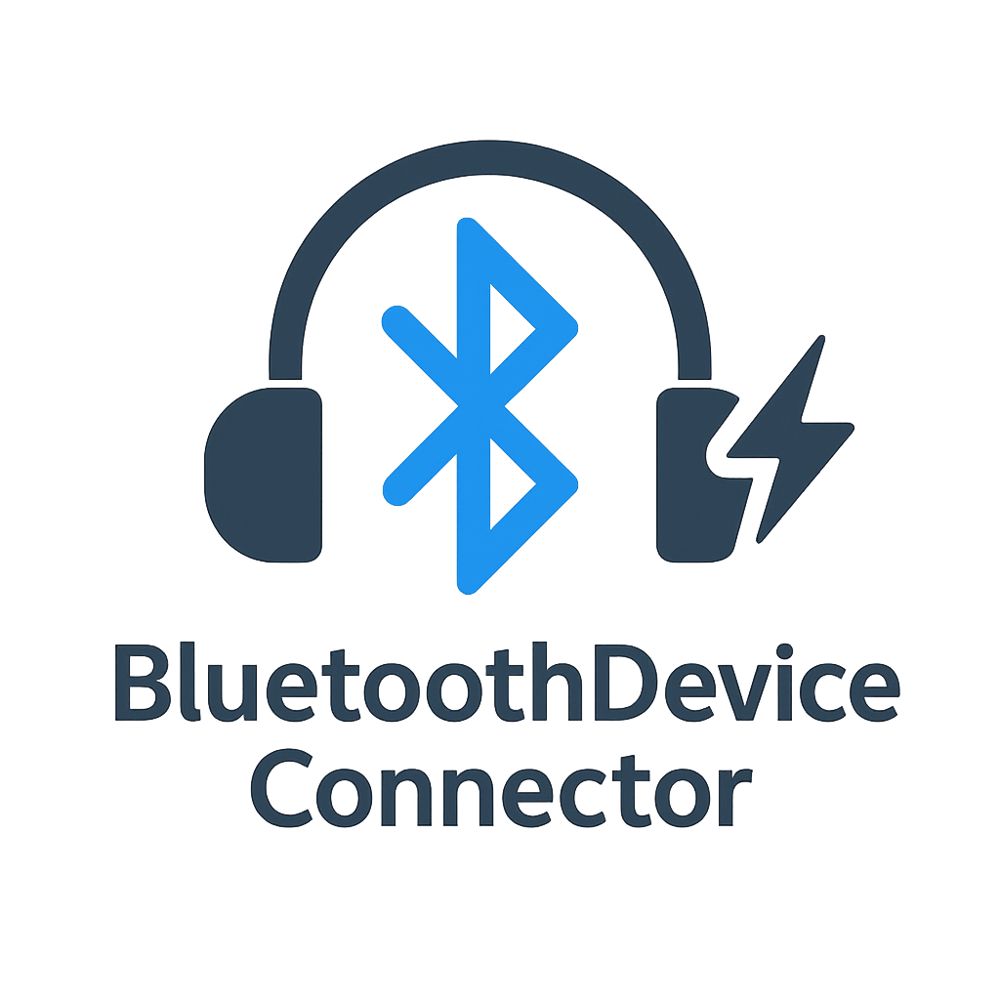

# 🎧 BluetoothDeviceConnector

<div align="center">
  
</div>

<div align="center">
  
  
  
</div>
<p align="center">
  
  
  
  
</p>
<p align="center">
  <a href="https://github.com/sponsors/ChromuSx"></a>
  <a href="https://ko-fi.com/chromus"></a>
  <a href="https://buymeacoffee.com/chromus"></a>
  <a href="https://www.paypal.com/paypalme/giovanniguarino1999"></a>
</p>
<p align="center">
  <strong>🔗 BluetoothDeviceConnector is a script created in AutoHotkey that allows you to automatically connect a specific Bluetooth device, such as "AirPods Pro". This script uses the Windows Bluetooth Control Panel to find and connect the specified device.</strong>
</p>

## Features ✨
- Automatically searches for the specified Bluetooth device.
- Connects the device to Handsfree services (for voice communication) and AudioSink services (for music streaming).
- Provides visual notifications for success or errors.

## Requirements 🛠️
- **Operating System**: Windows
- **Libraries**: The script uses the Bluetooth control library provided by Windows (`Bthprops.cpl`).
- **System Icon**: The script uses a system icon (requires the path `C:\WINDOWS\system32\netshell.dll`).
- **AutoHotkey**: Must be installed to run this script. [Download AutoHotkey](https://www.autohotkey.com/).

## How to Use 🚀
1. **Install AutoHotkey**: Make sure AutoHotkey is installed.
2. **Copy the code**: Copy the script code into `BluetoothDeviceConnector.ahk`.
3. **Run the script**: Double-click the `.ahk` file to run the script.

### Configuration ⚙️
Modify the `deviceName` variable at the beginning of the script to match the name of the Bluetooth device you want to connect. By default, it is set to "AirPods Pro":

```ahk
deviceName := "AirPods Pro"
```

Change this value to connect other devices.

## How It Works 🧠
The script uses a system library (`Bthprops.cpl`) to search for the desired Bluetooth device. If the device is found, it will attempt to activate two services:

- **Handsfree**: Connection for voice communications (e.g., calls).
- **AudioSink**: Connection for audio streaming (e.g., music).

A confirmation message will be displayed if the device is successfully connected.

## Notifications 🔔
The script will display notifications in case of:
- No Bluetooth device found.
- Device successfully connected.

## Limitations ⚠️
- The script is designed to connect to a specific device. It does not support multiple connections or advanced Bluetooth device management.
- It works only on Windows, using the Bluetooth libraries provided by the operating system.

## Customization 🛠️
You can customize the script to include more devices or add extra functionality. AutoHotkey is a versatile scripting language that allows you to automate many operations on Windows.

## Contributions 🤝
Contributions and improvements are welcome! Feel free to submit a pull request or report any issues on [GitHub](https://github.com/ChromuSx/BluetoothDeviceConnector).

## License 📜
This project is licensed under the MIT License. Feel free to use, modify, and distribute the script as you like.
