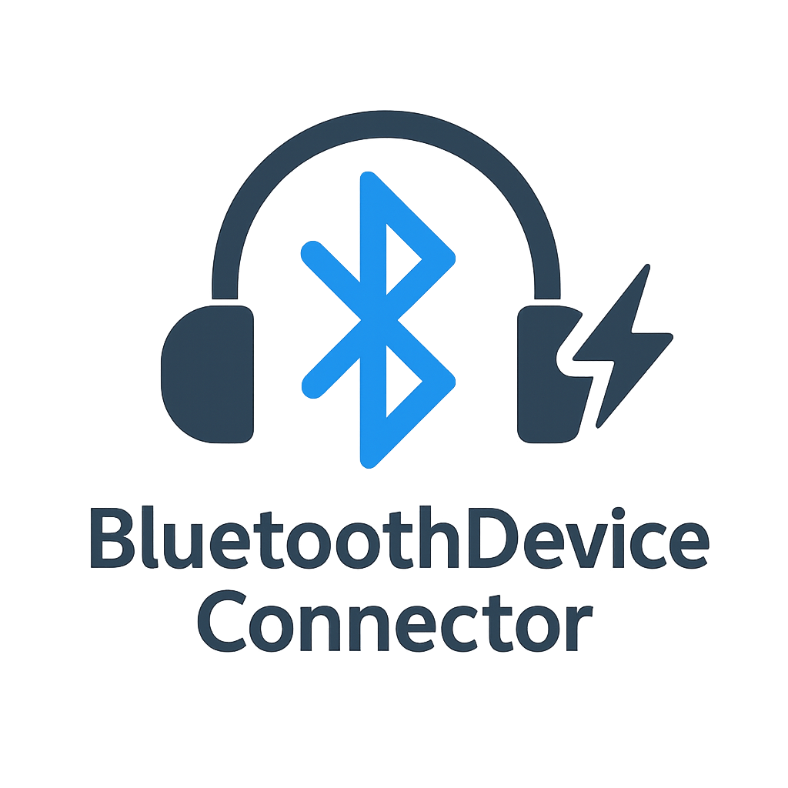

# 🎧 BluetoothDeviceConnector

<div align="center">
  
</div>

<div align="center">
  
  
  
</div>
<p align="center">
  
  
  
  
  
</p>
<p align="center">
  <a href="https://github.com/sponsors/ChromuSx"></a>
  <a href="https://ko-fi.com/chromus"></a>
  <a href="https://buymeacoffee.com/chromus"></a>
  <a href="https://www.paypal.com/paypalme/giovanniguarino1999"></a>
</p>
<p align="center">
  <strong>🔗 BluetoothDeviceConnector is a script created in AutoHotkey that allows you to automatically connect a specific Bluetooth device, such as "AirPods Pro". This script uses the Windows Bluetooth Control Panel to find and connect the specified device.</strong>
</p>

## ✨ Features
- Automatically searches for the specified Bluetooth device.
- Connects the device to Handsfree services (for voice communication) and AudioSink services (for music streaming).
- Provides visual notifications for success or errors.
- **🎮 Stream Deck Integration**: One-click Bluetooth connection directly from your Elgato Stream Deck!

## 🎮 Stream Deck Plugin

This project includes an **official Stream Deck plugin** that lets you connect your Bluetooth devices with a single button press!

<div align="center">
  <a href="https://marketplace.elgato.com/product/bluetooth-device-connector-d7e642fc-1199-4ca0-9849-e303281dd07d">
    
  </a>
</div>

https://github.com/user-attachments/assets/05e95be0-e882-46ef-b7d7-b2d59a091051

<sub>▶ Press play for sound. Not rendering (e.g. outside GitHub)? <a href="streamdeck-plugin/marketplace/promo.mp4">Download the MP4</a>.</sub>

### Quick Start
1. Install directly from the [Elgato Marketplace](https://marketplace.elgato.com/product/bluetooth-device-connector-d7e642fc-1199-4ca0-9849-e303281dd07d) or download from [GitHub Releases](https://github.com/ChromuSx/BluetoothDeviceConnector/releases/latest)
2. Add the "Connect Bluetooth Device" action to your Stream Deck
3. Pick your device from the dropdown and connect instantly!

### Features
- ✅ One-click connect/disconnect toggle
- 🔍 Device picker — choose a paired device from a dropdown in the Property Inspector
- 🔊 Speaker-only device support (Amazon Echo Dot, Bluetooth speakers, and devices without HFP)
- 📡 Live connection state — button icon stays in sync after Stream Deck restarts
- 🎯 Visual feedback (Disconnected / Connecting / Connected / Error states)
- 🚀 Fast and lightweight

[→ Learn more about the Stream Deck plugin](streamdeck-plugin/)

## 🛠️ Requirements
- **Operating System**: Windows
- **Libraries**: The script uses the Bluetooth control library provided by Windows (`Bthprops.cpl`).
- **System Icon**: The script uses a system icon (requires the path `C:\WINDOWS\system32\netshell.dll`).
- **AutoHotkey v2**: Must be installed to run this script. [Download AutoHotkey v2](https://www.autohotkey.com/).

## 🚀 How to Use
1. **Install AutoHotkey v2**: Make sure AutoHotkey v2 is installed.
2. **Copy the code**: Copy the script code into `bluetooth_device_connector.ahk`.
3. **Run the script**: Double-click the `.ahk` file to run the script.

### ⚙️ Configuration
Modify the `deviceName` variable at the beginning of the script to match the name of the Bluetooth device you want to connect. By default, it is set to "AirPods Pro":

```ahk
deviceName := "AirPods Pro"
```

Change this value to connect other devices.

## 🧠 How It Works
The script uses a system library (`Bthprops.cpl`) to search for the desired Bluetooth device. If the device is found, it will attempt to activate two services:

- **Handsfree**: Connection for voice communications (e.g., calls).
- **AudioSink**: Connection for audio streaming (e.g., music).

A confirmation message will be displayed if the device is successfully connected.

## 🔔 Notifications
The script will display notifications in case of:
- No Bluetooth device found.
- Device successfully connected.

## ⚠️ Limitations
- The script is designed to connect to a specific device. It does not support multiple connections or advanced Bluetooth device management.
- It works only on Windows, using the Bluetooth libraries provided by the operating system.

## 🛠️ Customization
You can customize the script to include more devices or add extra functionality. AutoHotkey is a versatile scripting language that allows you to automate many operations on Windows.

## 🤝 Contributions
Contributions and improvements are welcome! Feel free to submit a pull request or report any issues on [GitHub](https://github.com/ChromuSx/BluetoothDeviceConnector).

## 💖 Support the Project
This project is completely free and open source. If you find it useful and would like to support its continued development and updates, consider making a donation. Your support helps keep the project alive and motivates me to add new features and improvements!

<div align="center">
  <a href="https://github.com/sponsors/ChromuSx"></a>
  <a href="https://ko-fi.com/chromus"></a>
  <a href="https://buymeacoffee.com/chromus"></a>
  <a href="https://www.paypal.com/paypalme/giovanniguarino1999"></a>
</div>

Every contribution, no matter how small, is greatly appreciated! ❤️

## 📜 License
This project is licensed under the MIT License. Feel free to use, modify, and distribute the script as you like.

<div align="center">
  <sub>Made with ❤️ by <a href="https://github.com/ChromuSx">Giovanni Guarino</a></sub>
</div>
