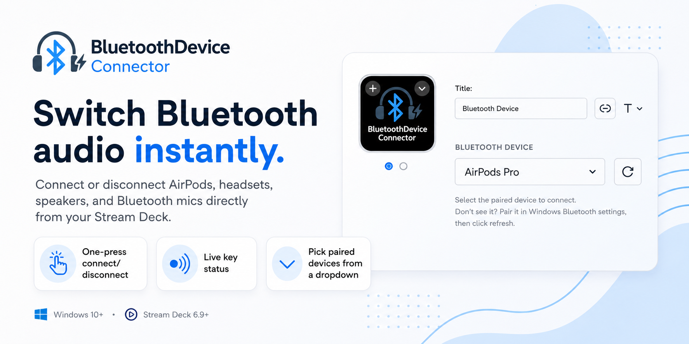
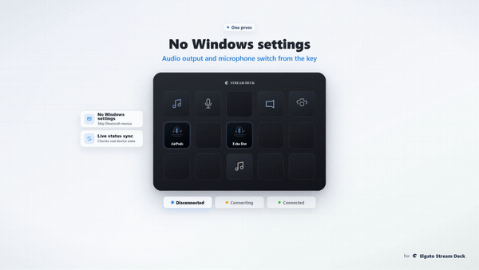
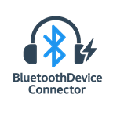
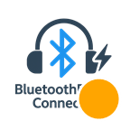
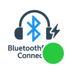
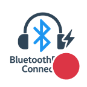
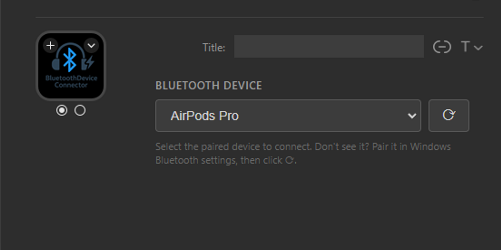

# Bluetooth Device Connector - Stream Deck Plugin

  

**Eliminate the hassle of navigating Windows Bluetooth settings!** Connect your Bluetooth devices with a single button press on your Elgato Stream Deck.

Perfect for streamers, content creators, and anyone who frequently switches between Bluetooth headphones, speakers, microphones, and other peripherals. No more interrupting your workflow to dig through Windows settings—just press a button and go!

## See It in Action

  
    
  <a href="marketplace/promo.mp4"><b>▶ Watch the full 27-second promo</b></a>

## Why Use This Plugin?

- 🚀 **Instant Switching** - Toggle devices in under a second
- 🎥 **Streamer-Friendly** - Switch audio devices mid-stream without alt-tabbing
- 🎯 **Never Miss a Beat** - Visual and audio feedback confirms every action
- 🔄 **Multi-Device Ready** - Manage all your Bluetooth devices from one place

## Key Features

- **One-Click Connect/Disconnect** - Toggle your Bluetooth device connection with a single button press
- **Device Picker** - Choose a paired device from a dropdown in the Property Inspector — no need to type the exact name
- **Speaker-Only Device Support** - Works with speakers and devices that lack the Handsfree (HFP) profile, such as Amazon Echo Dot and Bluetooth speakers
- **Live Connection State** - The button icon reflects the device's real connection status when it appears, surviving Stream Deck restarts
- **Visual State Indicators** - See the connection status at a glance:
  - 🔵 **Disconnected** - Default blue icon
  - 🟠 **Connecting** - Orange dot while connecting
  - 🟢 **Connected** - Green dot when connected
  - 🔴 **Error** - Red dot if connection fails
- **Audio Feedback** - Hear Windows system sounds for success and errors
- **Text Notifications** - Button displays status text ("Connected!", "Disconnected!", "Error!")
- **Multi-Device Support** - Add multiple buttons for different Bluetooth devices

  
  &nbsp;&nbsp;
  
  &nbsp;&nbsp;
  
  &nbsp;&nbsp;
  
   
  Disconnected · Connecting · Connected · Error

## Installation

### From Elgato Marketplace _(recommended)_

1. Open the [Elgato Marketplace page](https://marketplace.elgato.com/product/bluetooth-device-connector-d7e642fc-1199-4ca0-9849-e303281dd07d)
2. Click **Get** — Stream Deck installs the plugin automatically
3. Find "Bluetooth Device Connector" in your Stream Deck actions list

### From Release Package

1. Download `com.chromusx.bluetooth-connector.streamDeckPlugin` from the [latest release](https://github.com/ChromuSx/BluetoothDeviceConnector/releases)
2. Double-click the downloaded file
3. Stream Deck will automatically install the plugin
4. Find "Bluetooth Device Connector" in your Stream Deck actions list

## Quick Start

1. **Drag & Drop** - Add the "Connect Bluetooth Device" action to any Stream Deck button
2. **Configure** - Pick your device from the dropdown in the Property Inspector, or type its name manually (e.g., "AirPods Pro", "Sony WH-1000XM4")
3. **Press & Connect** - That's it! Your device connects instantly

  
   
  Pick any paired device from the dropdown — no typing required

## Use Cases

- 🎧 **Content Creators** - Quickly switch between streaming headset and editing headphones
- 🎮 **Gamers** - Toggle between gaming headset and speakers without leaving your game
- 💼 **Remote Workers** - Seamlessly switch audio devices during back-to-back meetings
- 🎵 **Music Producers** - Instantly A/B test mixes on different Bluetooth speakers

## Requirements

- **Platform**: Windows 10 or later
- **Stream Deck Software**: Version 6.9 or later

## License

MIT License - See LICENSE file for details

## Support

- **Issues**: [GitHub Issues](https://github.com/ChromuSx/BluetoothDeviceConnector/issues)

## Credits

Created by [ChromuSx](https://github.com/ChromuSx)
