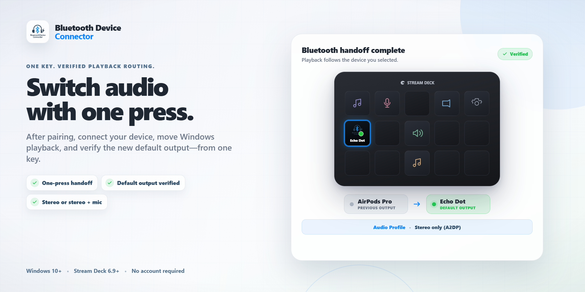
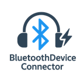
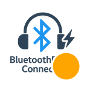
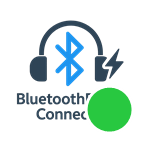
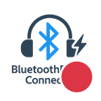
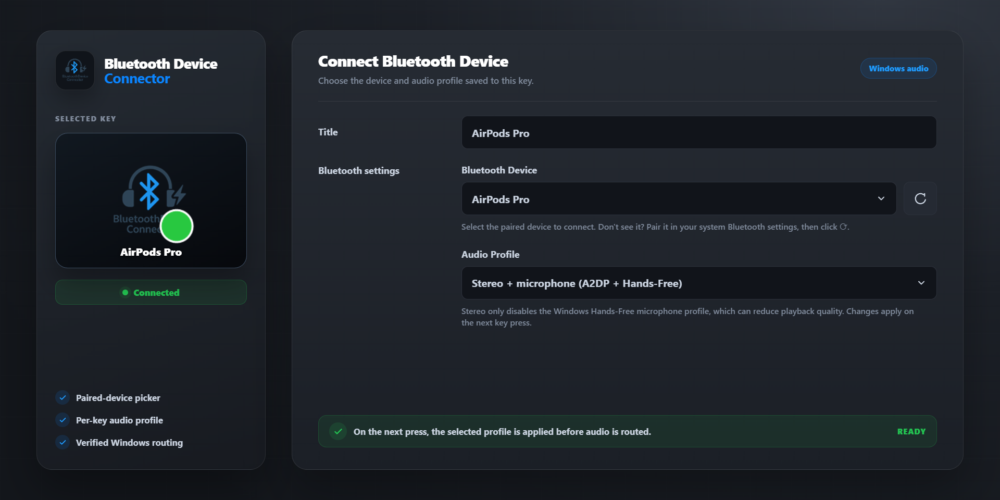

# Bluetooth Device Connector - Stream Deck Plugin

  

**Eliminate the hassle of navigating Bluetooth settings!** Connect your Bluetooth devices with a single button press on your Elgato Stream Deck.

Perfect for streamers, content creators, and anyone who frequently switches between Bluetooth headphones, speakers, microphones, and other peripherals. No more interrupting your workflow to dig through system settings—just press a button and go!

## See It in Action

  <a href="marketplace/promo.mp4"><strong>▶ Watch the updated 27-second promo (MP4)</strong></a>

## Why Use This Plugin?

- 🚀 **One-Press Switching** - Toggle paired devices directly from a key
- 🎥 **Streamer-Friendly** - Switch audio devices mid-stream without alt-tabbing
- 🎯 **Never Miss a Beat** - Visual and audio feedback confirms every action
- 🔄 **Multi-Device Ready** - Manage all your Bluetooth devices from one place

## Key Features

- **One-Click Connect/Disconnect** - Toggle your Bluetooth device connection with a single button press
- **Device Picker** - Choose a paired device from a dropdown in the Property Inspector — no need to type the exact name
- **Per-Key Audio Profile** - On Windows, choose stereo-only A2DP or stereo plus the Hands-Free microphone profile
- **Exclusive Same-Key Handoff** - Change the device on a key and its next press disconnects that key's previous target before connecting the new one
- **Verified Windows Audio Routing** - After connecting, the plugin selects and verifies the matching default playback endpoint; with A2DP + HFP it also tries the device microphone when Windows exposes one
- **Speaker-Only Device Support** - Works with speakers and devices that lack the Handsfree (HFP) profile, such as Amazon Echo Dot and Bluetooth speakers
- **Safe Restart State** - Windows keys reapply their selected audio profile on the first press when device-wide Bluetooth status cannot prove the requested audio services are active
- **Visual State Indicators** - See the connection status at a glance:
  - 🔵 **Disconnected** - Default blue icon
  - 🟠 **Connecting** - Orange dot while connecting
  - 🟢 **Connected** - Green dot when connected
  - 🔴 **Error** - Red dot if connection fails
- **Audio Feedback** - Hear native system sounds for success and errors
- **Text Notifications** - Button displays status text ("Connected!", "Disconnected!", "Error!")
- **Multi-Device Support** - Add multiple buttons for different Bluetooth devices

  
  &nbsp;&nbsp;
  
  &nbsp;&nbsp;
  
  &nbsp;&nbsp;
  
   
  Disconnected · Connecting · Connected · Error

## Installation

**Install from Elgato Marketplace for automatic updates and the verified official build.**

1. Open the [Elgato Marketplace page](https://marketplace.elgato.com/product/bluetooth-device-connector-d7e642fc-1199-4ca0-9849-e303281dd07d)
2. Click **Get** — Stream Deck installs the plugin automatically
3. Find "Bluetooth Device Connector" in your Stream Deck actions list

## Quick Start

1. **Drag & Drop** - Add the "Connect Bluetooth Device" action to any Stream Deck button
2. **Configure** - Pick your device and, on Windows, choose **Stereo only (A2DP)** or **Stereo + microphone (A2DP + HFP)**
3. **Press & Connect** - The device connects and becomes the verified default Windows playback endpoint; after changing a key's device, the same press first disconnects its previous target

  
   
  Pick a paired device and choose its Windows audio profile

## Use Cases

- 🎧 **Content Creators** - Quickly switch between streaming headset and editing headphones
- 🎮 **Gamers** - Toggle between gaming headset and speakers without leaving your game
- 💼 **Remote Workers** - Seamlessly switch audio devices during back-to-back meetings
- 🎵 **Music Producers** - Switch playback between paired Bluetooth speakers

## Requirements

- **Platform**: Windows 10 or later
- **Stream Deck Software**: Version 6.9 or later

## License

MIT License - See LICENSE file for details

## Support

- **Issues**: [GitHub Issues](https://github.com/ChromuSx/BluetoothDeviceConnector/issues)

## Credits

Created by [ChromuSx](https://github.com/ChromuSx)
